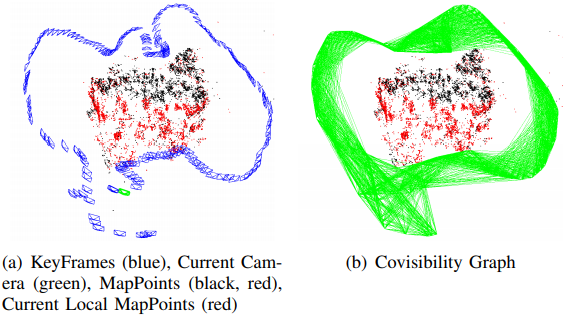

# 关键帧
https://blog.csdn.net/ncepu_Chen/article/details/116784875
## 共视图

能看到同一地图点的两关键帧之间存在共视关系,共视地图点的数量被称为权重  

蓝色的是关键帧，(b)中的连线就是关键帧的共视关系

### 变量
+ 当前关键帧的共视关键帧及权重 `std::map<KeyFrame*,int> mConnectedKeyFrameWeights;` 
  + value是当前关键帧到key所指的关键帧的权重
  + 作者把他当无序字典用

+ 所有共视关键帧,按权重从大到小排序 `std::vector<KeyFrame*> mvpOrderedConnectedKeyFrames `
+ 所有共视权重,按从大到小排序 `std::vector<int> mvOrderedWeights`
  + 所谓共视权重，就是自己的共视关键帧和自己看到了多少个相同的地图点

### 函数
+ 基于当前关键帧对地图点的观测构造共视图 `void UpdateConnections()`
  1. 统计每一个地图点都有多少关键帧与当前关键帧存在共视关系，统计结果放在KFcounter  
     KFconter是关键帧的指针到计数的字典，就是记录其他关键帧有几个和自己相同的地图点  
  2. 找到对应权重最大的关键帧`pKFmax`，自己和其他哪个关键帧共视地图点最多
     当共视地图点超过阈值(15个)，建立共视关键帧 `AddConnection`，  
     并将{权重，关键帧的指针}加入vPair
  3. 如果没有连接到关键帧（超过阈值的权重），则对权重最大的关键帧建立连接
  4. 更新共视关键帧3大变量
     + vPair从大到小按排序（按关键帧的权重）（作者写的sb）
     + mConnectedKeyFrameWeights = KFcounter
     + mvpOrderedConnectedKeyFrames = vPair\[:,0\] //伪代码
     + mvOrderedWeights = vPair\[:,1\]
  5. 更新生成树的连接
  
  调用时机：关键帧和地图点的连接关系发生变化（包括**关键帧创建**和**地图点重新匹配**关键帧特征点）
  + Tracking线程中初始化函数Tracking::StereoInitialization()或Tracking::MonocularInitialization()函数创建关键帧后会调用KeyFrame::UpdateConnections()初始化共视图信息.
  + LocalMapping线程接受到新关键帧时会调用函数LocalMapping::ProcessNewKeyFrame()处理跟踪过程中加入的地图点,之后会调用KeyFrame::UpdateConnections()初始化共视图信息.(实际上这里处理的是Tracking线程中函数Tracking::CreateNewKeyFrame()创建的关键帧)
  + LocalMapping线程处理完毕缓冲队列内所有关键帧后会调用LocalMapping::SearchInNeighbors()融合当前关键帧和共视关键帧间的重复地图点,之后会调用KeyFrame::UpdateConnections()更新共视图信息.
  + LoopClosing线程闭环矫正函数LoopClosing::CorrectLoop()会**多次**调用KeyFrame::UpdateConnections()更新共视图信息。优化->更新，再优化->更新

+ 添加共视关键帧 `void AddConnection(KeyFrame* pKF, int &weight)`
  + 应该为private

+ 删除共视关键帧 `void EraseConnection(KeyFrame* pKF)`
  + 应该为private

+ 基于共视图信息修改对应变量 `void UpdateBestCovisibles()`
  + 应该为private

## 生成树
优化共视图太重，生成树是对共视图的简化
！
上图表示含有一个10个节点,20条边的稠密图;粗黑线代表其最小生成树,只需9条边即可将所有节点连接起来  
回环闭合时只需对最小生成树做BA优化(实际上并没有对最小生成树做BA优化,而是对包含生成树的本质图（本质图=最小生成树+一些东西）做BA优化)
### 变量
+ 当前关键帧是否还未加入到生成树 `bool mbFirstConnection`
  + 未加入是true，加入是false
+ 父节点 `KeyFrame* mpParent`
+ 子节点 `std::set<KeyFrame*> mspChildrens`
### 函数

### 生成树结构改变的时机
+ 关键帧增加到生成树的时机：updateConnections
+ 只有当关键帧删除的时候，导致共视图改变，生成树才改变
  + 详见后文
+ 其他共视图改变不会影响生成树

## 关键帧删除

### 成员
+ 坏帧 `mbbad`
+ 是否具有不被删除的特权 `mbNotErase`
  + **回环检测的关键帧不会被删除**
  + 回环检测线程会用`setNotErase`
+ 当前关键帧是否曾被豁免过删除 `mbToBeErased`
  + 参与回环检测时，如果要删它，这个设true，参与回环检测后再删
  + 在LoopClosing不需要该关键帧时，调用`SetErase`，在`SetErase`中，取消不被删除特权，如果`mbToBeErased`，则调用`SetBadFlag()`

### 函数
+ 删除关键帧`SetBadFlag`
  1. 检测 `mpMap->GetInitKFid()` 和 `mbNotErase`
  2. 遍历所有和当前关键帧共视的关键帧，删除他们与当前关键帧的联系 `EraseConnection`
  3. 遍历每一个当前关键帧的地图点，删除每一个地图点和当前关键帧的联系 `MapPoint::EraseObservation`
  4. 更新生成树，主要是处理好父子关键帧，克鲁斯卡尔最小生成树加边法
     1. `set<KeyFrame *> sParentCandidates` 存候选的父节点
     2. 将当前帧的父关键帧放入候选父关键帧
     3. 直到当前帧的子关键帧未空
        1. 对当前帧的子关键帧遍历
           1. 子关键帧遍历每一个与它共视的关键帧，
           2. 对于每个在共视关键帧中的候选的父节点，求权重最大的（共视地图点最多的）
           3. 保存这一对子关键帧`pC`和父关键帧`pP` C:child P:parent
        2. 如果:在上面的过程中找到了新的父节点，
           1. 将`pC`的父节点设为`pP`
           2. 候选父节点`sParentCandidates`加入`pC`
           3. 将子关键帧从当前关键帧中删除
        3. 如果:没找到直接break退出
     4. 如果还有子节点没有找到新的父节点，直接把这些节点的爷爷节点作为父节点
  5. 最后父节点删了当前节点（没从内存中删），设置父节点到当前节点的变换`mTcp`（干什么用？），标记`mbBad`，

## 关键帧与地图点
+ 关键帧中观测到的地图点 `vector<MapPoint *> mvpMapPoints`
    + 对于某个地图点，所有能看到他的关键帧是`std::map<KeyFrame*, std::tuple<int,int>> mObservations`   
      那个tuple存的是地图点在mvpMapPoints的序号，tuple的第1个代表左目，第2个代表右目

### 地图点曾查改删的时机

+ 增加地图点
  1. Tracking线程和LocalMapping线程创建新地图点后,会马上调用函数KeyFrame::AddMapPoint()添加当前关键帧对该地图点的观测.
  2. LocalMapping线程处理完毕缓冲队列内所有关键帧后会调用LocalMapping::SearchInNeighbors()融合当前关键帧和共视关键帧间的重复地图点,其中调用函数ORBmatcher::Fuse()实现融合过程中会调用函数KeyFrame::AddMapPoint().
  3. LoopClosing线程闭环矫正函数LoopClosing::CorrectLoop()将闭环关键帧与其匹配关键帧间的地图进行融合,会调用函数KeyFrame::AddMapPoint().
+ 地图点的删除和修改
  1. MapPoint删除函数MapPoint::SetBadFlag()或替换函数MapPoint::Replace()会调用KeyFrame::EraseMapPointMatch()和KeyFrame::ReplaceMapPointMatch()删除和替换关键针对地图点的观测.
  2. LocalMapping线程调用进行局部BA优化的函数Optimizer::LocalBundleAdjustment()内部调用函数KeyFrame::EraseMapPointMatch()删除对重投影误差较大的地图点的观测.

### 本质图与回环检测
Essential 本质图 
+ 和当前帧形成回环的关键帧集合 `std::set<KeyFrame*> mspLoopEdge`
本质图=生成树+回环检测的关键帧+共视关系超过100的强关键帧
LoopClosing线程中回环矫正函数`LoopClosing::CorrectLoop()`在调用本质图BA优化函数`Optimizer::OptimizeEssentialGraph()`之前会调用函数`KeyFrame::AddLoopEdge()`,在当前关键帧和其闭环匹配关键帧间添加回环关系.  
在调用本质图BA优化函数`Optimizer::OptimizeEssentialGraph()`中会调用函数`KeyFrame::GetLoopEdges()`将所有闭环关系加入到本质图中进行优化.

## KeyFrame生命周期
由Tracking创建，LocalMapping销毁
+ 创建：
  + Tracking线程中通过函数`Tracking::NeedNewKeyFrame()`判断是否需要关键帧
  + 使用`Tracking::CreateNewKeyFrame()`创建
+ 销毁：
  + LocalMapping线程剔除冗余关键帧函数`LocalMapping::KeyFrameCulling()`中若检查到某关键帧为冗余关键帧
  + 使用`KeyFrame::SetBadFlag()`销毁