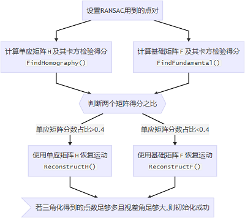

# ~~单目初始化 Initialize.cpp~~
ORB-SLAM1的，ORB-SLAM3里已经弃用，ORB-SLAM3放在Track::MonocularInitialization里面了  
第1帧叫参考帧，第2帧叫当前帧
## 变量
+ 参考帧的特征点 `vector<cv::KeyPoint> mvKeys1`
+ 当前帧的特征点 `vector<cv::KeyPoint> mvKeys2`
+ 从参考帧到当前帧的匹配特征点对 `vector<pair<int,int>> mvMatches12`
  + 存的是id
+ 参考帧特征点是否在当前帧存在匹配特征点 `vector<bool> mvbMatched1`
+ 相机内参 `cv::Mat mK`
+ 重投影误差阈值及其平方 `float mSigma, mSigma2`
+ RANSAC迭代次数 `int mMaxIterations`
+ 二维容器500✖8 每一层保存RANSAC计算H和F矩阵所需的八对点 `vector<vector<size_t>> mvSets`

## 函数
### 构造函数 `Initialize`

1. 设置RANSAC用到的点对
2. 检验得分
   + 单应矩阵H及卡方检验 `FindHomography`
   + 基础矩阵F及卡方检验 `FindFundamental`

3. 判断两个矩阵得分之比
   + 单应矩阵H恢复运动
   + 基础矩阵F恢复运动
4. 若三角化得到的点足够多 and 视差角足够大 则初始化成功

### 计算基础矩阵F和单应矩阵H
平面场景和纯旋转长江合适用单应矩阵，
+ RANSAC
+ 基础矩阵 `FindFundamental` 
  最少7对点，作者采用8对点  
  F矩阵的秩为2

+ 单应矩阵 `FindHomography`
  最少4对点，作者采用8对点
  

### 卡方检验 CheckHomography
卡方表  
取0.95置信度为阈值，
+ 若统计量大于该阈值,则认为计算矩阵使用到了外点,将其分数设为0
+ 若统计量小于该阈值,则将统计量裕量设为该解的置信度分数.
单目是2个自由度，双目是3个自由度

### 恢复运动 ReconstructF
在相机前方三角化成功最多的点

# 单目(及IMU)初始化 Track::MonocularInitialization
具体原理同Initialize.cpp

