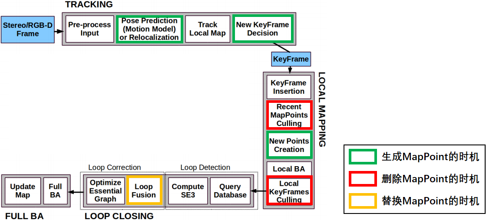

# 地图点

https://blog.csdn.net/ncepu_Chen/article/details/116784652
3D的点，来源于特征点的三角化
一个地图点会被多个关键帧观测到

## 属性

+ 世界坐标mWorldPos Eigen::Vector3f
+ 描述子 mDescriptor cv::Mat所有关键帧的特征点描述子的中值（该特征描述子到其他所有描述子的中值距离最小：对某一个特征点，求它到其他特征点的距离的中值，所有这些点的中值距离最小的点）
  + 更新时机：地图点到关键帧的观测mObservations发生改变（关键帧改变）
  + 用途：
    + ORBmatcher::SearchByProjection()和ORBmatcher::Fuse()，比较地图点特征描述子和图片特征描述子，地图点和图片点的匹配（3D到2D匹配）
+ 与关键帧的关系
  + mObservations 存关键帧指针到（地图点在关键帧的id，用一个tuple左右双目分别存）
+ nObs 记录被多少相机检测到

## 函数

+ 平均观测距离
  mfMaxDistance mfMinDistance特征点在图像金字塔上的最大或最小观测距离
+ 更新平均观测方向和距离 UpdateNormalAndDepth

  + 平均观测方向：根据mObservations中所有观测到本地图点的关键帧得到
  + 平均观测距离：根据参考关键帧得到
  + 调用位置：**地图点本身**或**关键帧对该地图点的观测发生变换**
    + 创建地图点时初始化
    + 地图点对关键帧的观测mObservations更新
      1. 跟踪局部地图添加或删除关键帧
      2. LocalMapping线程删除陈宇关键帧
      3. LoopClosing线程闭环矫正
    + 3大线程中的BA优化的点
+ 参考关键帧获得

  + 构造函数中，构造这个地图点的关键帧
  + 如果被删除，随便取一个(实际取的是根据指针排序的第一个，因为指针的顺序未知，所以是随便取的：mObservations.begin()->first)
  +
+ 地图点描述子的计算 `ComputeDistinctiveDescriptors`

  1. 获取所有观测，跳过坏点
  2. 遍历观测到3d点的所有关键帧，获得orb描述子，并插入到vDescriptors中
  3. 获得这些描述子两两之间的距离
  4. 选择最有代表性的描述子，它与其他描述子应该具有最小的距离中值
+ 地图点删除和替换

  + SetBadFlag 标记mbBad
  + Replace 替换mpReplaced

+ 召回率相关变量
  + 实际观测到该地图点的帧数 `int MapPoint::mnFound`
  + 理论上应当观测到该地图点的帧数 `int MapPoint::mnVisible`
  + 调用时机
    + 在函数`Tracking::SearchLocalPoints()`中，会对所有处于当前帧视锥内的地图点调用成员函数`MapPoint::IncreaseVisible()`.(这些点未必真的被当前帧观测到了,只是地理位置上处于当前帧视锥范围内).
    + 在函数`Tracking::TrackLocalMap()`中，会对所有当前帧观测到的地图点调用`MaoPoint::IncreaseFound()`
    + 在函数`LocalMapping::MapPointCulling()`中，根据召回率判断这点是否要被剔除

## MapPoint生命周期(ORB-SLAM2)

+ 创建
  通过三角化(GeometricTools::Triangulate)创建地图点只有两处，单目初始化里算F和H(TwoViewReconstruction::Reconstruct)和LocalMapping::CreateNewMapPoints（通过相邻两个关键帧三角化算地图点）
  1. Tracking线程中初始化过程(Tracking::MonocularInitialization()和Tracking::StereoInitialization())
  2. Tracking线程中创建新的关键帧(Tracking::CreateNewKeyFrame())，单目不在这里产生地图点
  3. Tracking线程中恒速运动模型跟踪(Tracking::TrackWithMotionModel())也会产生临时地图点,但这些临时地图点在跟踪成功后会被马上删除(那跟踪失败怎么办?跟踪失败的话不会产生关键帧,这些地图点也不会被注册进地图)
     使用了上一帧(mLastFrame)的地图点进行投影匹配
  4. LocalMapping线程中创建新地图点的步骤(LocalMapping::CreateNewMapPoints())会将当前关键帧与前一关键帧进行匹配,生成新地图点.  
     在LocalMapping中创建的关键帧通过Tracking::mpReferenceKF将新生成的地图点传回Tracking
+ 删除
  1. LocalMapping线程中删除恶劣地图点的步骤(LocalMapping::MapPointCulling()).
  2. 删除关键帧的函数KeyFrame::SetBadFlag()会调用函数MapPoint::EraseObservation()删除地图点对关键帧的观测,若地图点对关键帧的观测少于2,则地图点无法被三角化,就删除该地图点.
+ 替换
  1. LoopClosing线程中闭环矫正(LoopClosing::CorrectLoop())时当前关键帧和闭环关键帧上的地图点发生冲突时,会使用闭环关键帧的地图点替换当前关键帧的地图点.
  2. LoopClosing线程中闭环矫正函数LoopClosing::CorrectLoop()会调用LoopClosing::SearchAndFuse()将闭环关键帧的共视关键帧组中所有地图点投影到当前关键帧的共视关键帧组中,发生冲突时就会替换.
