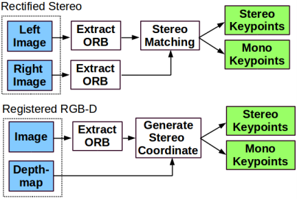

# 帧

## 属性

### 相机内参

内参应该是static
双面相机的基线等

### 特征点

+ 左右目特征点提取器 `ORBextractor* mpORBextractorLeft, *mpORBextractorRight`
+ 左右目特征点描述子 `cv::Mat mDescriptors, mDescriptorsRight`
+ 畸变矫正前左右目特征点 `std::vector<cv::KeyPoint> mvKeys, mvKeysRight`
+ 畸变矫正后左目特征点（没右目） `std::vector<cv::KeyPoint> mvKeysUn;`
+ 左目特征点对应的右目特征点的横坐标（左右目纵坐标相同） `std::vector<float> mvuRight`
+ 特征点深度 `std::vector<float> mvDepth;`
+ 近点远点阈值 `mThDepth` 在双目（和RGBD?）中，因为远的点不准，远的匹配的的点被视为单目点

## 函数

+ 特征点提取 `ExtractORB()`
+ 双目 & RGBD预处理
  
+ 双目特征点的处理:特征点匹配 `ComputeStereoMatches()`
  初始化的时候做了极线匹配，使得左目上的点在右目中有？

  1. 粗匹配: 根据特征点**描述子距离**（汉明距离）和**金字塔层级**判断匹配.粗匹配关系是按行寻找的,对于左目图像中每个特征点,在右目图像对应行上寻找匹配特征点.
  2. 精匹配: 根据特征点**周围窗口内容**相似度判断匹配。两个匹配上的特征点，以此为中心画一个25x25的区域，用滑动窗看这两个区域什么时候二范数最小
  3. 亚像素插值: 将特征点相似度与匹配坐标之间拟合成二次曲线,寻找最佳匹配位置(得到的是一个小数).
  4. 记录右目匹配mvuRight和深度mvDepth信息.
  5. 离群点筛选: 以平均相似度的2.1倍为标准,筛选离群点.
+ RGBD特征点的处理:根据左目和深度构造虚拟的右目图像 `ComputeStereoFromRGBD`

+ 畸变矫正
  + 双目相机不需要畸变矫正
    （Example_old/stereo_euroc的主函数所在的文件矫正了(cv::initUndistortRectifyMap)，但是新的Example写在System::settings里），
    所以没有畸变矫正后的右目的特征点
  + 单目和RGBD在这里矫正，使用cv::initUndistortRectifyMap

+ 将特征点分配到图像网格中 `AssignFeaturesToGrid`
  将每个特征点在mvKeysUn中的索引值放到对应的网格mGrid中 48行64列  
  这里Nleft=-1 Nright对于单目双目RGBD都是-1，两个相机模式不是  
  两个相机模式 id小于Nleft的点被认为是左目，大于等于的被认为是右目。`mvKeysRight``mvGridRight`都是针对两个相机模式加的  
  特征点匹配的时候加速计算，只匹配特征点所在中心3x3的网格  
+ 构造函数

## 用途

Tracking类里有两个Frame成员变量，一个上一帧，一个当前帧
