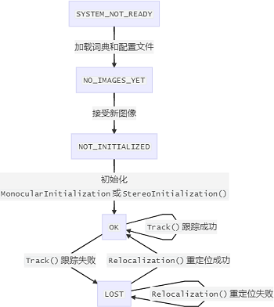
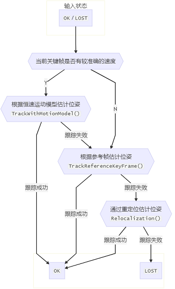

# 跟踪线程
https://blog.csdn.net/ncepu_Chen/article/details/116785040
### 跟踪状态
+ eTrackingState
  + SYSTEM_NOT_READY 系统没有准备好,一般就是在启动后加载配置文件和词典文件时候的状态
  + NO_IMAGES_YET 还没有接收到输入图像
  + NOT_INITIALIZED  接收到图像但未初始化成功
  + OK 跟踪成功
  + LOST 跟踪失败
+ mState 当前帧mCurrentFrame的跟踪状态
+ mLastProcessedState 前一帧mLastFrame的跟踪状态

## 初始化

### 变量
+ 当前帧 `Frame mCurrentFrame`
+ 参考关键帧 `KeyFrame* mpReferenceKF`
+ 局部关键帧列表 `std::vector<KeyFrame*> mvpLocalKeyFrames`
  + 初始化成功后向其中添加局部关键帧
+ 局部地图点列表 `std::vector<MapPoint*> mvpLocalMapPoints`
  + 初始化成功后向其中添加局部地图点

单目初始化相关
+ 单目初始化参考帧(实际上就是前一帧) `Frame mInitialFrame`
+ 单目初始化中三角化得到的地图点坐标 `std::vector<cv::Point3f> mvIniP3D`
+ 单目初始化参考帧地图点 `std::vector<cv::Point2f> mvbPrevMatched`
+ 单目初始化中参考帧的地图点id到当前帧的地图点id匹配关系 `std::vector<int> mvIniMatches`

### 函数
+ 单目初始化 `MonocularInitialization`
  + ORB-SLAM2
    + 第1帧创建单目初始化器
    + 第2帧如果特征点数大于100则匹配
    + 如果匹配特征点超过100个则调用初始化器Initialize函数匹配

+ 创建单目初始化局部地图  `CreateInitialMapMonocular()`
  1. 单目初始化的时候，认为参考帧和当前帧都是关键帧，生成关键帧`pKFini`和`pKFcur`
  2. 将初始关键帧,当前关键帧的描述子转为BoW，词袋是特征点聚类的结果
  3. 将关键帧插入到Atlas的当前地图（ORBLSMA2是加到Map里）
  4. 创建地图点
     1. 构造地图点，将地图点加入
     2. 为该MapPoint添加关键帧 `MapPoint::AddObservation`
     3. 为该MapPoint添加描述子 `MapPoint::ComputeDistinctiveDescriptors`
     4. 为该MapPoint添加平均观测方向和深度范围 `MapPoint::UpdateNormalAndDepth`
  5. 更新关键帧的共视图 `KeyFrame::UpdateConnections`
  6. 全局BA优化，同时优化所有位姿和三维点
  7. 取场景的中值深度，用于尺度归一化
    + 两个条件,一个是平均深度要大于0,另外一个是在当前帧中被观测到的地图点的数目应该大于50
    + 将两帧之间的变换归一化到平均深度1的尺度下
    + 把3D点的尺度也归一化到1
    + 注意：对于IMU，这里保存了参考帧和当前帧到`mPrevKF``mNextKF`，并进行了IMU预积分 `IMU::Preintegrated`
  8. 关键帧插入局部地图，更新归一化后的位姿、局部地图点

+ 双目和RGBD初始化 `StereoInitializationStereoInitialization`
左目大于500个特征点，就算初始化成功

## 初始位姿估计

ORB-SLAM2

### 变量
+ 前一帧 `Frame mLastFrame`
  + `TrackWithMotionModel()`与该帧匹配搜索关键点
+ 相机前一帧运动速度 `cv::Mat mVelocity`
  + 主函数Tracking::Track()中调用完函数Tracking::TrackLocalMap()更新局部地图和当前帧位姿后,就计算速度并赋值给mVelocity
+ 临时地图点 `list<MapPoint*> mlpTemporalPoints`
  + 双目/RGBD相机输入时,为前一帧生成的临时地图点跟踪成功后该容器会被清空,其中的地图点会被删除
  + 用于标记在`UpdateLastFrame`中生成了哪些临时地图点
+ 参考关键帧 `KeyFrame* mpReferenceKF`
  + 每当Tracking线程创建一个新的关键帧时,就将其设为参考关键帧
  + 跟踪局部地图的函数`Tracking::TrackLocalMap()`内部会将与当前帧共视点最多的局部关键帧设为参考关键帧.

### 函数
+ `Track`
+ 根据恒速运动模型估计位姿 `TrackWithMotionModel()`
  1. 更新上一帧的位姿；对于双目或RGB-D相机，还会根据深度值生成临时地图点
  2. 如果IMU完成初始化 并且 距离重定位不久不需要重置IMU，用IMU来估计位姿 并**返回true**
  3. 根据恒速模型得到当前帧的**初始位姿估计**
  4. 根据初始位姿估计进行投影匹配
     1. 清空当前帧的地图点
     2. 设置特征匹配过程中的搜索半径 双目为7，其他为15
     3. 上一帧地图点进行匹配`ORBmatcher.SearchByProjection`
     4. 如果匹配点太少（<20），则扩大搜索半径为原来的2倍再来一次
     5. 再搜索不到则失败
     6. 搜索结果保存在`Frame::mvpMapPoints`里
  5. BA优化**当前帧**的位姿`Optimizer::PoseOptimization(Frame*)`
  6. 剔除外点，外点是`Optimizer::PoseOptimization(Frame*)`里面算的
     匹配的点大于10个就算成功  

  思考: 为什么函数Tracking::TrackReferenceKeyFrame()没有检查当前参考帧mpReferenceKF是否被LocalMapping线程删除了?  
  回答: 因为LocalMapping线程剔除冗余关键帧函数LocalMapping::KeyFrameCulling()不会删除最新的参考帧,有可能被删除的都是之前的参考帧.

+ 根据参考帧估计位姿 `TrackReferenceKeyFrame()`
  1. 计算当前帧的词袋
  2. 当前帧和参考关键帧根据词袋进行匹配 `ORBmatcher::SearchByBoW`  
     如果匹配结果过少（<15）则跟踪失败
  3. 将上一帧的位姿态作为当前帧位姿的初始值
  4. 位姿优化
  5. 剔除外点
     匹配的点大于10个就算成功

+ 通过重定位估计位姿 `Relocalization()`  
  当前帧丢了，在下一帧的时候进入重定位
  1. 根据当前帧描述子计算词袋
  2. 根据词袋找到当前帧的候选参考关键帧`KeyFrameDatabase::DetectRelocalizationCandidates`
  3. 遍历所有的候选关键帧，通过BoW进行快速匹配，用匹配结果初始化MLPnPSolver（ORBSLAM2是PNPSolver）  
     因为当前是用地图的3D点匹配大概年前帧的2D点，所以是PNP  
     足够的内点才能匹配使用PNP算法，MLPnP需要至少6个点  
  4. 使用MLPnPsolver估计初始位姿,并根据初始位姿获取足够的匹配特征点  
     为什么搞这么复杂？答：是担心误闭环
     + ORB-SLMA2:
       1. 通过MLPnP算法估计姿态，迭代5次
       2. 如果PnP 计算出了位姿，对内点进行BA优化
       3. 剔除外点
       4. 若匹配特征点数目太少,则尝试第2次进行特征匹配+位姿优化
       5. 若匹配特征点数目太少,则尝试第3次进行特征匹配+位姿优化
       6. 若最后匹配数目终于足够了,则跟踪成功，否则失败
     + ORB-SLAM3: 更复杂
       1. 1
       2. 2

+ 双目/RGBD相机,为前一帧生成临时地图点 `UpdateLastFrame()`
  1. 利用参考关键帧（位姿准）更新上一帧（不一定是关键帧）在世界坐标系下的位姿
    + l:last, r:reference, w:world
    + Tlw = Tlr*Trw 
  2. 如果上一帧为关键帧，或者单目/单目惯性，SLAM模式的情况，则退出
    因为双目和RGBD生成地图点比较容易，单目麻烦
  3. 对于双目或rgbd相机，为上一帧生成新的临时地图点（不加入到地图中）
     1. 得到上一帧中具有有效深度值的特征点（不是地图点），保存在`vector<pair<float,int> > vDepthIdx;`深度到id的映射
     2. 按照深度从小到大排序
     3. for循环，从中找出不是上一帧的地图点（没有三角化）的点或没有被观测的点，（双目相机远了不能被三角化）
     4. 对3中的地图点，包装为地图点（临时地图点），加到`mvpMapPoints`，并在`mlpTemporalPoints`标记
     5. 地图点数目足够多且比较远，认为地图点质量不好，停止生成地图点
        

## 跟踪局部地图
### 变量
+ 局部关键帧列表std::vector<KeyFrame*>
+ 局部地图点列表std::vector<MapPoint*>

### 函数
+ 局部地图进行跟踪 `TrackLocalMap`
  1. 更新局部地图,包括局部关键帧列表`mvpLocalKeyFrames`和局部地图点列表`mvpLocalMapPoints`
  2. 将局部地图点投影到当前帧特征点上 `SearchLocalPoints()`
  3. BA优化得到更准确的位姿
  4. 更新当前帧的地图点被观测程度，并统计跟踪局部地图后匹配数目  
     地图点观测数值会被用作LocalMapping线程中LocalMapping::MapPointCulling()函数剔除坏点的标准之一
  5. 根据跟踪匹配数目及重定位情况决定是否跟踪成功（防止误闭环）

+ 更新局部地图 `UpdateLocalMap()`
  + 更新局部关键帧`UpdateLocalKeyFrames()`   
  + 更新局部地图点`UpdateLocalPoints()`
    + 清空局部地图点
    + 遍历局部关键帧 mvpLocalKeyFrames
      + 将局部关键帧的地图点添加到`mvpLocalMapPoints`

+ 更新局部关键帧 `UpdateLocalKeyFrames()`  
  update其实是create，能不能改成增量式的？
  如果IMU未初始化 或者 刚刚完成重定位使用`mCurrentFrame`否则使用`mLastFrame`
  1. 局部关键帧列表`mvpLocalKeyFrames`会被清空并重新赋值，包含以下3类关键帧
     1. 当前地图点的所有共视关键帧
     2. 1中所有关键帧的父子关键帧
     3. 1中所有关键帧共视关系前10大的共视关键帧
     4. IMU模式下增加了临时的关键帧 `mCurrentFrame.mpLastKeyFrame`
  2. 与当前帧共视关系最强的关键帧设为参考关键帧mpReferenceKF

+ 将局部地图点投影到当前帧特征点上 `SearchLocalPoints()`
  1. 遍历当前帧的地图点，标记这些地图点不参与之后的投影搜索匹配
  2. 统计视野内地图点数目 
  3. 如果需要进行投影匹配的点的数目大于0，就进行投影匹配

## 关键帧的创建

### 函数

+ 创建新关键帧 `CreateNewKeyFrame()`  
  + 创建新关键帧时,对于双目/RGBD相机输入情况下也创建新地图点
  + 考虑的方面
    1. 最近是否进行过重定位,重定位后位姿不会太准,不适合做参考帧.
    2. 当前系统的工作状态: 如果LocalMapping线程还有很多KeyFrame没处理的话,不适合再给它增加负担了
    3. 距离上次创建关键帧经过的时间: 如果很长时间没创建关键帧了的话,就要抓紧创建关键帧了
    4. 当前帧的质量: 当前帧观测到的地图点要足够多,同时与参考关键帧的重合程度不能太大

# Tracking流程中的关键问题

## 地图点的创建与删除
1. Tracking线程中初始化过程(Tracking::MonocularInitialization()和Tracking::StereoInitialization())会创建新的地图点.
2. Tracking线程中创建新的关键帧(Tracking::CreateNewKeyFrame())会创建新的地图点.
3. Tracking线程中根据恒速运动模型估计初始位姿(Tracking::TrackWithMotionModel())也会产生临时地图点,但这些临时地图点在跟踪成功后会被马上删除.

## 关键帧与地图点间发生关系的时机

1. 新创建出来的非临时地图点都会与创建它的关键帧建立双向连接
2. 通过ORBmatcher::SearchByXXX()函数匹配得到的帧点关系只建立单向连接
   + 只在关键帧中添加了对地图点的观测(将地图点加入到关键帧对象的成员变量mvpMapPoints中了).
   + 没有在地图点中添加对关键帧的观测(地图点的成员变量mObservations中没有该关键帧).
     

这为后文中LocalMapping线程中函数LocalMapping::ProcessNewKeyFrame()对关键帧中地图点的处理埋下了伏笔.该函数通过检查地图点中是否有对关键点的观测来判断该地图点是否是新生成的（可读性差）

## 参考关键帧 `mpReferenceKF`

+ 用途：
  1. Tracking线程中函数Tracking::TrackReferenceKeyFrame()根据参考关键帧估计初始位姿.
  2. 用于初始化新创建的MapPoint的参考帧mpRefKF,函数MapPoint::UpdateNormalAndDepth()中根据参考关键帧mpRefKF更新地图点的平均观测距离.

+ 指定：
  1. Traking线程中函数Tracking::CreateNewKeyFrame()创建完新关键帧后,会将新创建的关键帧设为参考关键帧.
  2. Tracking线程中函数Tracking::TrackLocalMap()跟踪局部地图过程中调用函数Tracking::UpdateLocalMap(),其中调用函数Tracking::UpdateLocalKeyFrames(),将与当前帧共视程度最高的关键帧设为参考关键帧.

